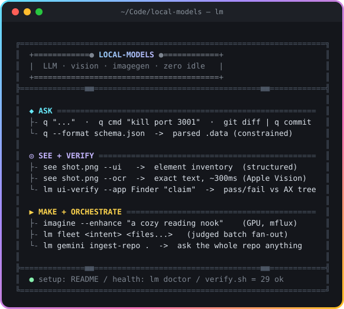

<div align="center">
  
</div>

<h1 align="center">local-models</h1>

<p align="center">
  A local LLM, vision, and image-generation toolkit for Apple Silicon.<br>
  Runs beside cloud Claude, costs nothing per call, and keeps zero models resident until you ask.
</p>

<p align="center">
  
  
  
  
</p>

---

## About

This is a set of bare commands (`q`, `see`, `imagine`, `review`, `warm`, `lm …`) that put
local models to work next to a cloud agent. The design bets are simple: **zero idle
penalty** (nothing stays in RAM unless you pin or lease it), **trust comes from gates,
not model confidence** (constrained decoding, judges, and verify batteries everywhere),
**a reasoned disk budget** (local-model storage stays under 150 GB by policy, not by a
brittle code check), and **histories are the API** (every call logs a JSONL line another
tool can read).

It grew out of daily agent work, so the tools favor the things agents actually need:
exact text from screenshots, pass/fail verification of UI claims, judged batch fan-out,
and a cheap huge-context side lane. Everything has `-h`. The full menu with examples
lives in [`docs/CAPABILITIES.md`](docs/CAPABILITIES.md).

## Easy setup

```bash
# 1. Clone
git clone https://github.com/alcatraz627/local-models.git ~/Code/local-models
cd ~/Code/local-models

# 2. Backend + basics
brew install ollama jq
brew services start ollama        # or: bin/lm-serve installs a tuned LaunchAgent

# 3. Models (the tiers config.sh expects; ~40 GB total, pull what you need)
ollama pull gemma4:26b            # big tier: reasoning, UI reads
ollama pull qwen3.6:35b-a3b       # code tier: review, fleet work
ollama pull minicpm-v4.6          # vision tier: see (smaller and better at UI structure than minicpm-v)
ollama create gemma4-e4b-warm -f modelfiles/gemma4-e4b-warm.Modelfile   # the warm companion

# 4. Put the commands on PATH
echo 'export PATH="$PATH:$HOME/Code/local-models/bin"' >> ~/.zshrc && exec zsh

# 5. Check it works
lm doctor                         # dependency + server + model health
./scripts/verify.sh               # the 38-check smoke battery (~1 min)
```

Optional extras, each unlocking one capability:

| Extra | Install | Unlocks |
|---|---|---|
| `glow` | `brew install glow` | pretty terminal rendering (`--glow` flags) |
| `mac-ocr` | `npm install -g mac-ocr` | `see --ocr` exact text via Apple Vision |
| `ax` | `cargo install --git https://github.com/watzon/ax-cli` | `lm ui-verify --app` live accessibility-tree reads |
| `repomix` | `npm install -g repomix` | `lm gemini ingest-repo` whole-repo packing |
| mflux venv | `uv venv && uv pip install mflux` | `imagine` local image generation |
| gemini-cli | `brew install gemini-cli` + API key in `~/.gemini/.env` | the `lm gemini` huge-context lane |

## Quick start

```bash
q cmd "free up port 3001"                      # one macOS command, no essay
git diff | q commit                             # commit message from the diff
see ~/Desktop/shot.png --ui                     # structured UI inventory of a screenshot
see shot.png --ocr --region top                 # exact text from one region, ~300ms
lm ui-verify --app Finder "there is a Trash menu item"   # pass/fail vs the live AX tree
imagine --enhance "a cozy reading nook"         # local image gen with LLM prompt expansion
lm fleet summarize docs/*.md                    # judged batch fan-out over files
lm gemini ingest-repo . && lm gemini ask "where is retry handled?"   # ask the whole repo
```

## Commands

| Command | What it does |
|---|---|
| `q "..."` | quick local answers; intents (`cmd`, `title`, `commit`…), `--format` schema-constrained JSON |
| `see ` | vision reads: `--ui` structured inventory · `--ocr` exact text · `--crop/--region` · artifact store per read |
| `lm ui-verify` | UI claim gate: screenshots or `--app` live accessibility trees; strict pass/fail/unsure |
| `review <pr#\|path>` | local code review; `--findings` returns structured objects |
| `imagine "..."` | image generation on the GPU (mflux); `redo/vary/refine`, history |
| `lm fleet` | one intent × N files, concurrency-capped, judge-gated |
| `lm index` | repo symbol map; "where is X" without a model call |
| `lm gemini` | wrapper-only huge-context lane; per-project sessions, `ingest-repo` |
| `warm on\|off [tier] [ttl]` | residency: pin the small companion or lease a big tier |
| `lm status\|doctor\|timeline` | health and merged history across all tools |

## Documentation

| Document | What's in it |
|---|---|
| [`docs/CAPABILITIES.md`](docs/CAPABILITIES.md) | the full menu — every ability, grouped, with examples |
| [`docs/STATE.md`](docs/STATE.md) | current state: architecture, DONE ledger, what can be done next |
| [`docs/q-spec.md`](docs/q-spec.md) | the `q` contract: intents, envelope, constrained decoding |
| [`docs/GOALS.md`](docs/GOALS.md) | per-command goals and design rationale |
| [`docs/03-…`](docs/03-tool-orchestration-decision.md) / [`04-…`](docs/04-ollama-vs-llamacpp-decision.md) / [`05-…`](docs/05-perf-levers-and-usage-audit.md) | the standing decisions: models never drive tools · stay on Ollama · measured perf levers |
| [`docs/09-local-fleet.md`](docs/09-local-fleet.md) | fleet design, derived from 269 real sub-agent dispatches |
| [`docs/research/`](docs/research/) | dated research archives (runtime, vision, imagegen) |

Personal toolkit, public repo. No license file yet; open an issue if you need one.
