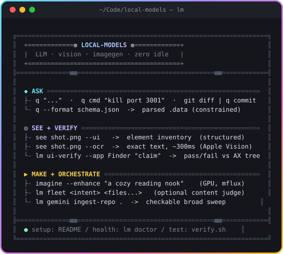

<div align="center">
  
</div>

<h1 align="center">local-models</h1>

<p align="center">
  Local text, vision, image generation, and evidence tools for Apple Silicon.<br>
  Built for people and coding agents who need a specific reason to call a model.
</p>

<p align="center">
  
  
  
  
</p>

---

## About

`q`, `see`, `imagine`, `review`, `warm`, and `lm` expose local models as command-line
tools. The strongest uses are deterministic table facts, exact screenshot text via
Apple Vision, visual evidence, repeatable batch work, and bounded retrieval. A
model's own confidence is never the acceptance check: callers inspect source
evidence or use a separate judge. Batch runs check the response envelope by
default; content judging is optional.

Ollama serves text and most vision models. MLX runs the default UI vision model,
while mflux generates images. `lm gemini` and `q --web` are optional connected
routes; their inputs leave the Mac. Model files in `~/.ollama/models` and
`~/.cache/huggingface` have a **150 GB steady-state budget**, with 200 GB as an
absolute ceiling. Model residency is controlled per request, by `warm` leases,
and by this machine's scheduled warmth jobs.

Run `lm help <job>` for a short, colored task path or `lm examples` for the full
showcase. Both remain readable when piped or when `NO_COLOR` is set. See the
[capability catalog](docs/CAPABILITIES.md) for every command and its limits.

## Start with local text

```bash
# Clone, then install the small CLI dependencies.
git clone https://github.com/alcatraz627/local-models.git
cd local-models
brew install ollama jq
# In one terminal, start Ollama with the repo's resource policy.
bin/lm-serve

# In another terminal, install the small default model and try it.
ollama pull gemma4:e4b-it-qat
ollama create gemma4-e4b-warm -f modelfiles/gemma4-e4b-warm.Modelfile
export PATH="$PWD/bin:$PATH"
q --json 'Reply with one word: ok'
lm help table
```

This is the minimal text path. For the complete setup, pull the models named
in [`config.sh`](config.sh), install the optional tools below, and
register a LaunchAgent for [`bin/lm-serve`](bin/lm-serve) if you want the server
at login. `lm doctor` checks this machine's full setup, including that
LaunchAgent, mflux, and commands on `PATH`. `scripts/verify.sh` exercises the
full suite with real model requests; it needs those dependencies and a running
server.

Optional extras, each unlocking one capability:

| Extra | Install | Unlocks |
|---|---|---|
| `glow` | `brew install glow` | pretty terminal rendering (`--glow` flags) |
| `mac-ocr` | `npm install -g mac-ocr` | `see --ocr` exact text via Apple Vision |
| `ax` | `cargo install --git https://github.com/watzon/ax-cli` | `lm ui-verify --app` live accessibility-tree reads |
| `repomix` | `npm install -g repomix` | `lm gemini ingest-repo` whole-repo packing |
| mflux venv | install `mflux` into this repo's `.venv` | `imagine` local image generation |
| gemini-cli | `brew install gemini-cli` + API key in `~/.gemini/.env` | the `lm gemini` huge-context lane |

## Quick start

```bash
q cmd "free up port 3001"                      # one macOS command, no essay
git diff | q commit                             # commit message from the diff
see ~/Desktop/shot.png --ui                     # structured UI inventory of a screenshot
see shot.png --ocr --region top                 # exact text from one region, ~300ms
lm ui-verify --app Finder "there is a Trash menu item"   # pass/fail vs the live AX tree
imagine --enhance "a cozy reading nook"         # local image gen with LLM prompt expansion
lm fleet summarize docs/*.md                    # batch fan-out; envelope checks by default
q describe-data --ctx data.csv --json           # exact table profile, no model arithmetic
lm bench quick                                  # fixed behavior and latency workload
lm gemini ingest-repo . && lm gemini ask "list retry handlers with file paths"  # broad sweep; verify cited paths
```

## Commands

| Command | What it does |
|---|---|
| `q "..."` | quick local answers; intents (`cmd`, `title`, `commit`…), `--format` schema-constrained JSON |
| `see ` | vision reads: `--ui` structured inventory · `--ocr` exact text · `--crop/--region` · artifact store per read |
| `lm ui-verify` | UI claim gate: screenshots or `--app` live accessibility trees; strict pass/fail/unsure |
| `review <pr#\|path>` | local code review; `--findings` returns structured objects |
| `imagine "..."` | image generation on the GPU (mflux); `redo/vary/refine`, history |
| `lm fleet` | one intent × N files; envelope gate, optional content judge, sampled human verdicts |
| `lm bench` | fixed fixture checks with latency, command process memory, and disk records |
| `lm rag` | optional local document retrieval; compare with direct context before adoption |
| `lm index` | repo symbol map; "where is X" without a model call |
| `lm gemini` | wrapper-only huge-context lane; per-project sessions, `ingest-repo` |
| `warm on\|off [tier] [ttl]` | residency: pin the small companion or lease a big tier |
| `lm status\|doctor\|timeline` | health and merged history across all tools |

## Documentation

| Document | What's in it |
|---|---|
| [`docs/CAPABILITIES.md`](docs/CAPABILITIES.md) | the full menu — every ability, grouped, with examples |
| [`docs/STATE.md`](docs/STATE.md) | architecture and dated implementation ledger; check live status before relying on it |
| [`docs/q-spec.md`](docs/q-spec.md) | the `q` contract: intents, envelope, constrained decoding |
| [`docs/03-tool-orchestration-decision.md`](docs/03-tool-orchestration-decision.md) | why the command owns file and tool access |
| [`docs/04-ollama-vs-llamacpp-decision.md`](docs/04-ollama-vs-llamacpp-decision.md) / [`docs/05-perf-levers-and-usage-audit.md`](docs/05-perf-levers-and-usage-audit.md) | dated runtime choice and measurements |
| [`docs/09-local-fleet.md`](docs/09-local-fleet.md) / [`docs/10-visual-compare-design.md`](docs/10-visual-compare-design.md) | batch-worker and visual-evidence design |
| [`docs/20260926-lm-implementation-trials.md`](docs/20260926-lm-implementation-trials.md) | latest speech, retrieval, Pi, and Codex trial results; outstanding gates included |
| [`docs/research/`](docs/research/) | dated research archives, not the current model inventory |

The [MIT license](LICENSE) covers this repository. Each tool writes its own
history or output artifact; see `lm timeline` and the capability catalog for
the current paths. Do not treat a successful model envelope as proof that its
answer is correct.

Personal toolkit, public repo. No license file yet; open an issue if you need one.
